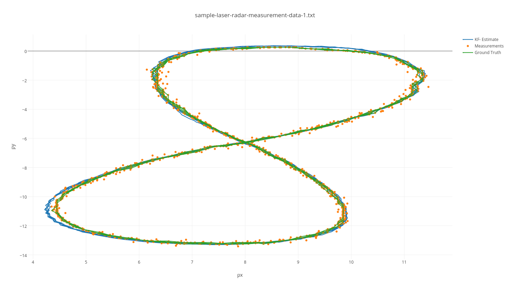

# Extended Kalman Filter
This Project is the sixth task (Project 1 of Term 2) of the Udacity Self-Driving Car Nanodegree program. The main goal of the project is to apply Extended Kalman Filter to fuse data from LIDAR and Radar sensors of a self driving car using C++.

The project was created with the Udacity [Starter Code](https://github.com/udacity/CarND-Extended-Kalman-Filter-Project).

## Content of this repo
- `scr` a directory with the project code:
  - `main.cpp` - reads in data, calls a function to run the Kalman filter, calls a function to calculate RMSE
  - `FusionEKF.cpp` - initializes the filter, calls the predict function, calls the update function
  - `kalman_filter.cpp`- defines the predict function, the update function for lidar, and the update function for radar
  - `tools.cpp` - a function to calculate RMSE and the Jacobian matrix
- `data`  a directory with two input files, provided by Udacity
- `results`  a directory with output and log files
- `Docs` a directory with files formats description
- [task.md](task.md) the task of the project by Udacity
- `extra` a directory with detailed information used hardware and software (`extra/additional_info.txt` file) and screenshots of the final RMSE. 

## Result

Accuracy - RMSE: [0.0651648, 0.0605379,  0.533212,  0.544193]

*Threshold*: RMSE <= [0.08, 0.08, 0.60, 0.60]

Accuracy - RMSE: [0.18566, 0.190271, 0.474522, 0.811142]

*Threshold*: RMSE <= [0.20, 0.20, .50, .85]

The results were visualized with [Sensor Fusion utilities](https://github.com/udacity/CarND-Mercedes-SF-Utilities).

## How to run the code
Clone this repo and perform 
```
mkdir build && cd build
cmake .. && make
./ExtendedKF ../data/sample-laser-radar-measurement-data-1.txt output1.txt > input1.log
./ExtendedKF ../data/sample-laser-radar-measurement-data-2.txt output2.txt > input2.log
```
For details, see [task.md](task.md)

The resulted output files are supplied in the [results](results) directory.


